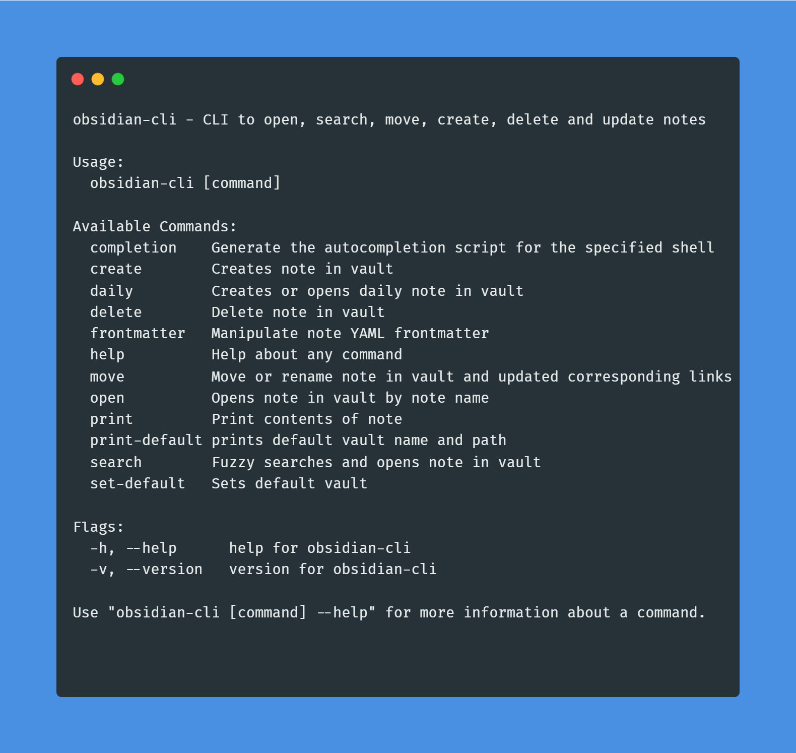

# Obsidian CLI

---

---

## Description

Obsidian is a powerful and extensible knowledge base application 
that works on top of your local folder of plain text notes. This CLI tool (written in Go) will let you interact with the application using the terminal. You are currently able to open, search, move, create, update and delete notes.

---

## Install

### Windows
You will need to have [Scoop](https://scoop.sh/) installed. On powershell run:
```
scoop bucket add scoop-yakitrak https://github.com/yakitrak/scoop-yakitrak.git
```

```
scoop install obsidian-cli
```

### Mac and Linux

You will need to have [Homebrew](https://brew.sh/) installed.

```Bash
brew tap yakitrak/yakitrak
```

```Bash
brew install yakitrak/yakitrak/obsidian-cli
```

For full installation instructions, see [Mac and Linux manual](https://yakitrak.github.io/obsidian-cli-docs/docs/install/mac-and-linux).

## Usage

### Help

```bash
# See All command instructions
obsidian-cli --help
```

### Set Default Vault

Defines default vault for future usage. If not set, pass `--vault` flag for other commands. You don't provide the path to vault here, just the name.

```bash
obsidian-cli set-default "{vault-name}"
```

Note: `open` and other commands in `obsidian-cli` use this vault's base directory as the working directory, not the current working directory of your terminal.

### Print Default Vault

Prints default vault and path. Please set this with `set-default` command if not set.

```bash
obsidian-cli print-default
```

### Open Note

Open given note name in Obsidian. Note can also be an absolute path from top level of vault.

```bash
# Opens note in obsidian vault
obsidian-cli open "{note-name}"

# Opens note in specified obsidian vault
obsidian-cli open "{note-name}" --vault "{vault-name}"

```

### Daily Note

Open daily note in Obsidian. It will create one (using template) if one does not exist.

```bash
# Creates / opens daily note in obsidian vault
obsidian-cli daily

# Creates / opens daily note in specified obsidian vault
obsidian-cli dauly --vault "{vault-name}"

```

### Search Note

Starts a fuzzy search displaying notes in the terminal from the vault. You can hit enter on a note to open that in Obsidian

```bash
# Searches in default obsidian vault
obsidian-cli search 

# Searches in specified obsidian vault
obsidian-cli search --vault "{vault-name}"

```

### Print Note

Prints the contents of given note name in Obsidian.

```bash
# Prints note in default vault
obsidian-cli print "{note-name}"

# Prints note in specified obsidian
obsidian-cli print "{note-name}" --vault "{vault-name}"

```

### Create / Update Note

Creates note (can also be a path with name) in vault. By default, if the note exists, it will create another note but passing `--overwrite` or `--append` can be used to edit the named note.

```bash
# Creates empty note in default obsidian and opens it
obsidian-cli create "{note-name}"

# Creates empty note in given obsidian and opens it
obsidian-cli create "{note-name}"  --vault "{vault-name}"

# Creates note in default obsidian with content
obsidian-cli create "{note-name}" --content "abcde"

# Creates note in default obsidian with content - overwrite existing note
obsidian-cli create "{note-name}" --content "abcde" --overwrite

# Creates note in default obsidian with content - append existing note
obsidian-cli create "{note-name}" --content "abcde" --append

# Creates note and opens it
obsidian-cli create "{note-name}" --content "abcde" --open

```

### Move / Rename Note

Moves a given note(path from top level of vault) with new name given (top level of vault). If given same path but different name then its treated as a rename. All links inside vault are updated to match new name.

```bash
# Renames a note in default obsidian
obsidian-cli move "{current-note-path}" "{new-note-path}"

# Renames a note and given obsidian
obsidian-cli move "{current-note-path}" "{new-note-path}" --vault "{vault-name}"

# Renames a note in default obsidian and opens it
obsidian-cli move "{current-note-path}" "{new-note-path}" --open
```

### Delete Note

Deletes a given note (path from top level of vault).

```bash
# Renames a note in default obsidian
obsidian-cli delete "{note-path}" 

# Renames a note in given obsidian
obsidian-cli delete "{note-path}" --vault "{vault-name}"
```

## Contribution
Fork the project, add your feature or fix and submit a pull request. You can also open an [issue](https://github.com/yakitrak/obsidian-cli/issues/new/choose) to report a bug or request a feature.

## License
Available under [MIT License](./LICENSE)
