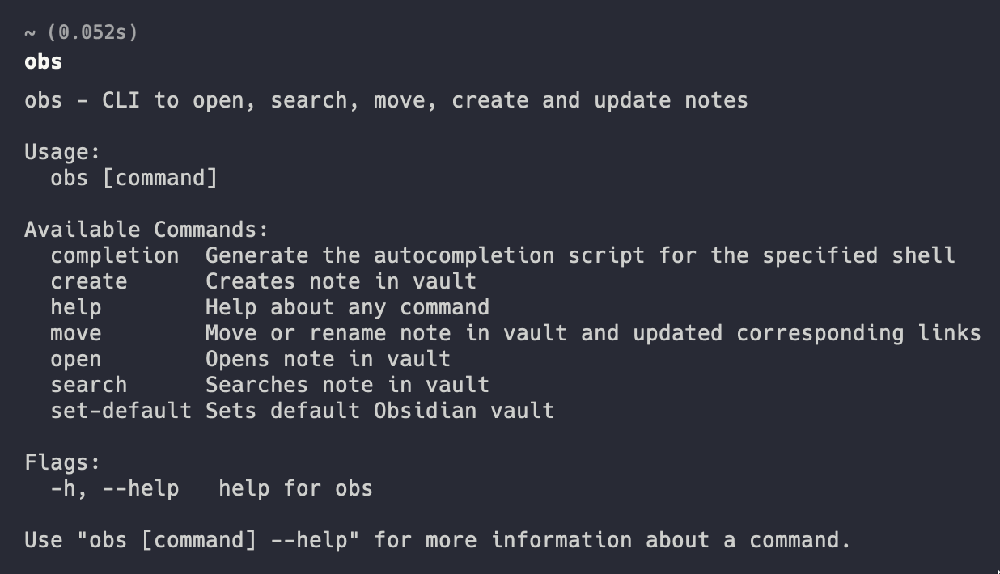

# Obsidian CLI Tool



## Description

[Obsidian](https://obsidian.md/) is a powerful and extensible knowledge base application
that works on top of your local folder of plain text notes. This CLI tool (written in [Go](https://go.dev/)) will let you interact with the application using the terminal. You are currently able to open, search, move, create and update notes.

## Install

### Homebrew

```Bash
brew tap yakitrak/yakitrak
```

```Bash
brew install yakitrak/yakitrak/obs
```

### Manual

1. Download the file from https://github.com/Yakitrak/obsidian-cli/releases
2. Set it to path:

- Mac: `sudo cp {name-of-file} /usr/local/bin/obs`
- Linux: `sudo cp {name-of-file} /usr/local/bin/obs`
- Windows: Set `{name-of-file}.exe` to path using [this](https://www.architectryan.com/2018/03/17/add-to-the-path-on-windows-10/)

## Usage

### Help

```bash
# See All command instructions
obs --help
```

### Set Default Vault

Defines default vault for future usage. If not set, pass `--vault` flag for other commands. You don't provide the path to vault here, just the name, as Obsidian already saves the paths to the vault which is what `obs` uses.

```bash
obs set-default "{vault-name}"
```

Note: `open` and other commands in `obs` use this vault's base directory as the working directory, not the current working directory of your terminal.

### Open Note

Open given note name in Obsidian. Note can also be an absolute path from root of vault.

```bash
# Opens note in obsidian
obs open "{note-name}"

# Opens note in specified vault
obs open "{note-name}" --vault "{vault-name}"

```

### Search Note

Opens obsidian search tab with given search text

```bash
# Searches in default vault
obs search "{search-text}"

# Searches in specified vault
obs search "{search-text}" --vault "{vault-name}"

```

### Create / Update Note

Creates note (can also be a path with name) in vault. By default if the note exists, it will create another note but passing `--overwrite` or `--append` can be used to edit the named note.

```bash
# Creates empty note in default vault and opens it
obs create "{note-name}"

# Creates empty note in given vault and opens it
obs create "{note-name}"  --vault "{vault-name}"

# Creates note in default vault with content
obs create "{note-name}" --content "abcde"

# Creates note in default vault with content - overwrite existing note
obs create "{note-name}" --content "abcde" --overwrite

# Creates note in default vault with content - append existing note
obs create "{note-name}" --content "abcde" --append

```

### Move / Rename Note

Moves a given note(path from vault root) with new name given (path from vault root). If given same path but different name then its treated as a rename. All links inside vault are updated to match new name.

```bash
# Renames a note in default vault
obs move "{current-note-path}" "{new-note-path}"

# Renames a note and given vault
obs move "{current-note-path}" "{new-note-path}" --vault "{vault-name}"

# Renames a note in default vault and opens it
obs move "{current-note-path}" "{new-note-path}" --open
```
